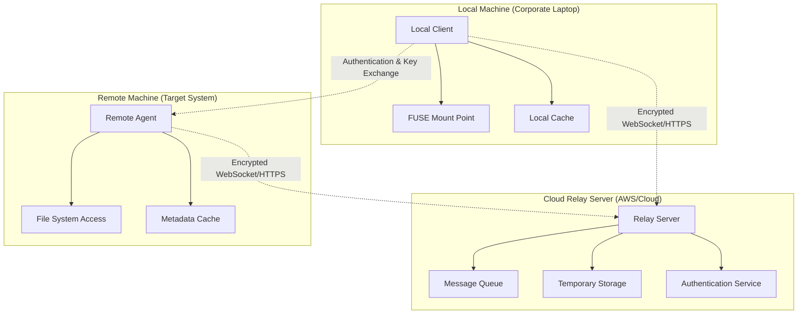

# RemoteFS - Encrypted Remote File System Architecture

## Overview

RemoteFS is an encrypted remote file system mounting solution that allows you to securely access files from a remote machine through a cloud relay server. This system is inspired by ZeroFS but focuses on connecting two specific machines (local and remote) through an intermediary cloud server.

## Architecture Components



## Component Details

### 1. Local Client (Runs on Corporate Laptop)

**Purpose**: Provides FUSE filesystem interface and manages local operations

**Responsibilities**:
- Mount remote directories as local FUSE filesystems
- Handle FUSE operations (read, write, create, delete, etc.)
- Encrypt/decrypt data using ChaCha20-Poly1305
- Manage connection to cloud relay server
- Implement local caching for performance
- Handle connection recovery and offline scenarios

**Key Modules**:
```rust
// Local client structure
src/client/
├── fuse_fs.rs       // FUSE filesystem implementation
├── cache.rs         // Local caching system
├── connection.rs    // Cloud relay connection management
├── crypto.rs        // Client-side encryption
├── config.rs        // Configuration management
└── main.rs          // Client entry point
```

### 2. Cloud Relay Server (Runs on AWS/Cloud Provider)

**Purpose**: Acts as intermediary between local client and remote agent

**Responsibilities**:
- Route messages between client and remote agent
- Provide persistent connection endpoints
- Handle client/agent authentication and authorization
- Manage temporary data storage for large file operations
- Support multiple client-agent pairs with proper isolation
- Monitor connection health and provide reconnection

**Key Modules**:
```rust
// Relay server structure
src/relay/
├── server.rs        // Main relay server
├── routing.rs       // Message routing between clients/agents
├── auth.rs          // Authentication and session management
├── storage.rs       // Temporary storage for large operations
├── health.rs        // Connection health monitoring
└── main.rs          // Server entry point
```

### 3. Remote Agent (Runs on Target Remote Machine)

**Purpose**: Provides secure file system access on the remote machine

**Responsibilities**:
- Execute file system operations on behalf of local client
- Encrypt/decrypt data before sending through relay
- Validate permissions and security constraints
- Manage metadata caching for performance
- Handle concurrent operations safely
- Monitor file system changes (optional)

**Key Modules**:
```rust
// Remote agent structure
src/agent/
├── fs_ops.rs        // File system operations
├── security.rs      // Permission validation
├── crypto.rs        // Agent-side encryption
├── metadata.rs      // Metadata caching
├── connection.rs    // Relay server connection
└── main.rs          // Agent entry point
```

### 4. Common/Shared Components

**Purpose**: Shared code and protocols used by all components

```rust
// Common modules
src/common/
├── protocol.rs      // Message protocol definitions
├── crypto.rs        // Shared encryption utilities
├── error.rs         // Error types and handling
├── config.rs        // Configuration structures
└── utils.rs         // Utility functions
```

## Communication Protocol

### Message Types

```rust
#[derive(Serialize, Deserialize)]
pub enum Message {
    // Authentication
    AuthRequest { client_id: String, public_key: Vec<u8> },
    AuthResponse { session_token: String, relay_info: RelayInfo },
    
    // File Operations
    ReadFile { path: String, offset: u64, length: u32 },
    WriteFile { path: String, offset: u64, data: Vec<u8> },
    CreateFile { path: String, mode: u32 },
    DeleteFile { path: String },
    
    // Directory Operations
    ListDir { path: String },
    CreateDir { path: String, mode: u32 },
    RemoveDir { path: String },
    
    // Metadata Operations
    GetMetadata { path: String },
    SetMetadata { path: String, metadata: FileMetadata },
    
    // System Messages
    Ping,
    Pong,
    Error { code: u32, message: String },
}
```

### Security Model

1. **End-to-End Encryption**: All file data is encrypted between client and agent
2. **Key Exchange**: Secure key exchange using X25519 ECDH
3. **Authentication**: Each client-agent pair has unique authentication tokens
4. **Data Integrity**: AEAD encryption ensures data integrity
5. **Access Control**: Remote agent validates all operations against configured permissions

### Data Flow Example - File Read Operation

```
1. Local Client (FUSE read) 
   ↓ [Encrypt request]
2. → Cloud Relay Server
   ↓ [Route to correct agent]
3. → Remote Agent
   ↓ [Decrypt, validate, read file]
4. ← Remote Agent  
   ↓ [Encrypt response data]
5. ← Cloud Relay Server
   ↓ [Route back to client]
6. Local Client (Decrypt, return to FUSE)
```

## Performance Considerations

### Caching Strategy
- **Local Client**: Cache frequently accessed files and metadata
- **Remote Agent**: Cache metadata and directory listings
- **Write-through**: Immediate writes to ensure consistency
- **TTL-based**: Time-based cache invalidation

### Connection Management
- **WebSocket Connections**: Persistent connections with heartbeat
- **Automatic Reconnection**: Handle network interruptions gracefully
- **Connection Pooling**: Multiple connections for parallel operations
- **Compression**: Compress large data transfers

### Optimization Features
- **Chunk-based Transfer**: Large files transferred in chunks
- **Parallel Operations**: Multiple concurrent file operations
- **Prefetching**: Predictive file prefetching based on access patterns
- **Delta Sync**: Only transfer changed portions of files

## Security Features

### Encryption
- **ChaCha20-Poly1305**: Fast, secure AEAD encryption
- **Key Rotation**: Periodic key rotation for long-lived connections
- **Perfect Forward Secrecy**: Each session uses unique keys

### Authentication
- **Mutual Authentication**: Both client and agent authenticate each other
- **Session Tokens**: Short-lived session tokens for ongoing operations
- **Certificate Pinning**: Prevent man-in-the-middle attacks

### Access Control
- **Path Restrictions**: Limit access to specified directories only
- **Permission Validation**: Respect file system permissions
- **Audit Logging**: Log all file system operations

## Configuration Example

### Client Configuration
```toml
# client.toml
[client]
id = "laptop-001"
relay_url = "wss://relay.example.com/ws"
mount_points = [
    { remote_path = "/home/user/projects", local_path = "/mnt/remote-projects" },
    { remote_path = "/home/user/.m2", local_path = "/mnt/remote-m2" }
]

[cache]
directory = "/tmp/remotefs-cache"
max_size_gb = 5.0
ttl_seconds = 3600

[security]
key_file = "~/.remotefs/client.key"
cert_file = "~/.remotefs/client.crt"
```

### Agent Configuration
```toml
# agent.toml
[agent]
id = "server-001"
relay_url = "wss://relay.example.com/ws"

[access]
allowed_paths = ["/home/user/projects", "/home/user/.m2", "/opt/data"]
read_only_paths = ["/home/user/.m2"]

[security]
key_file = "~/.remotefs/agent.key"
cert_file = "~/.remotefs/agent.crt"
```

## Deployment Architecture

### Cloud Infrastructure (AWS Example)
```
├── Application Load Balancer (ALB)
├── ECS Service (Auto Scaling)
│   └── Relay Server Containers
├── ElastiCache (Redis) - Session Storage
├── S3 - Temporary File Storage
└── CloudWatch - Monitoring & Logs
```

## Use Cases

1. **Development Environment Access**
   - Access source code on remote development server
   - Use remote build tools and dependencies
   - Maintain local IDE experience

2. **Dependency Management**
   - Share Maven (.m2) repositories
   - Share npm/pip caches
   - Access remote library installations

3. **Data Processing**
   - Access large datasets on remote servers
   - Process files without full downloads
   - Maintain data locality

## Next Steps

This architecture provides a solid foundation for implementing a secure, performant remote file system solution. The modular design allows for independent development and testing of each component while maintaining clear interfaces between them.
